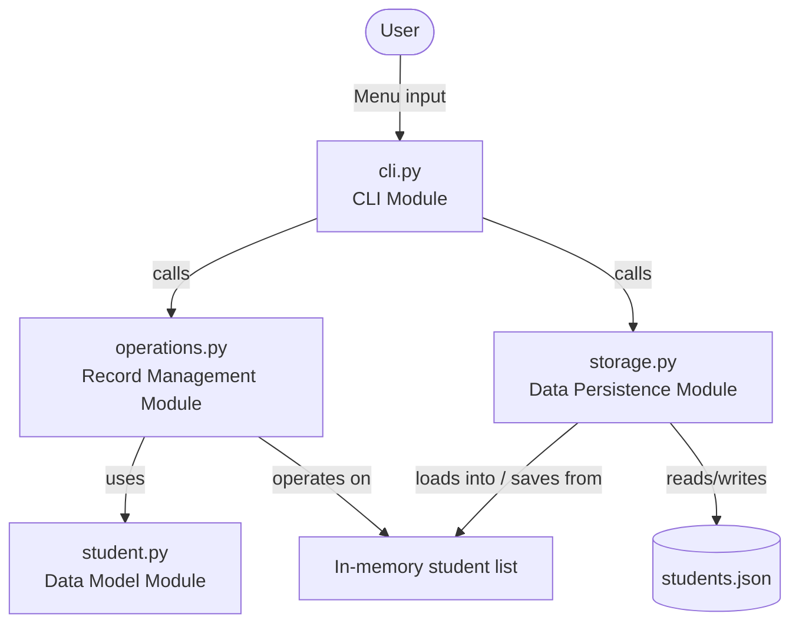
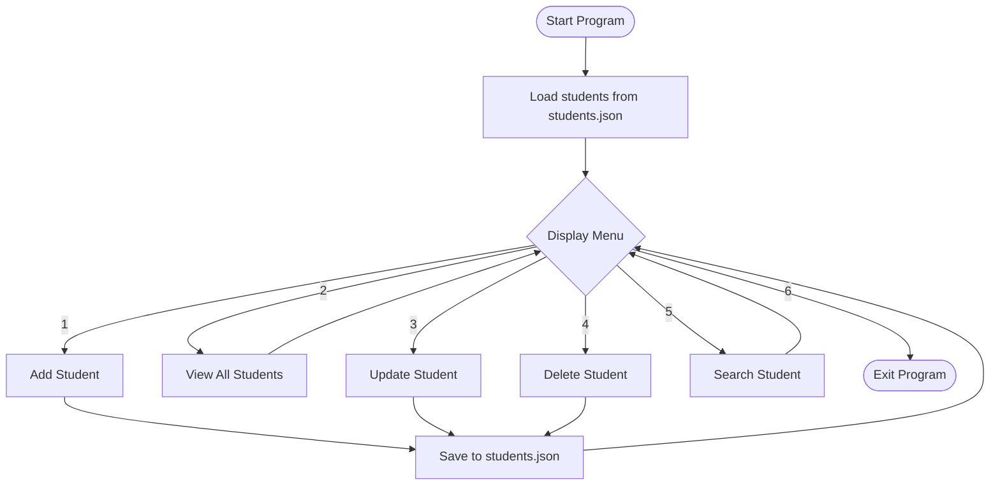
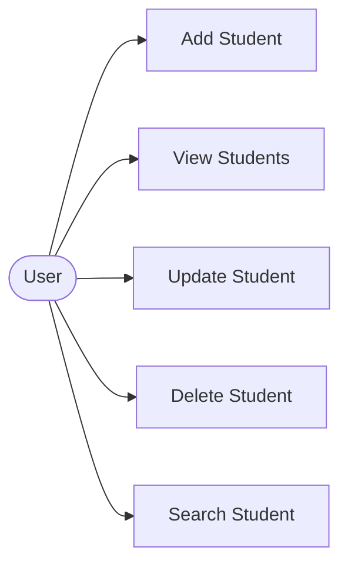
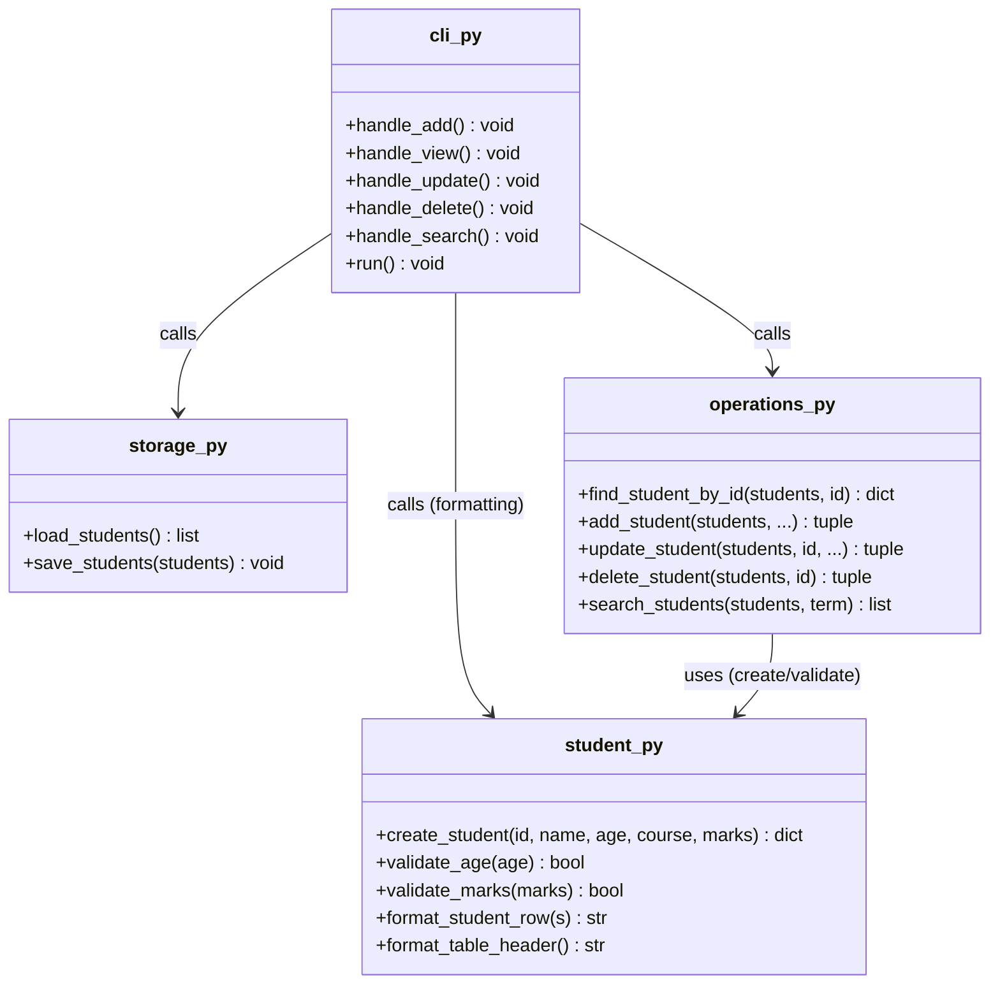
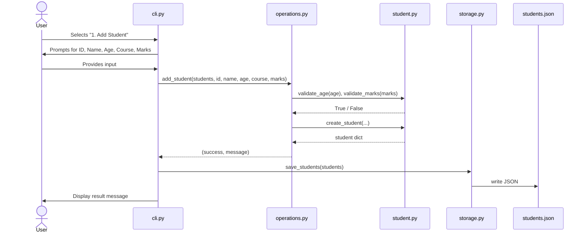

# Design Diagrams

This document contains the system architecture, workflow, and UML diagrams for the Student Record Management System. Diagrams are written in Mermaid syntax and render automatically on GitHub.

## 1. System Architecture Diagram

Shows how the four main modules relate to each other and to the data file.

## 2. Process Flow / Workflow Diagram

Shows the overall flow when the program runs.

## 3. Use Case Diagram

Shows the interactions available to the single user role of this system.

## 4. Class / Component Diagram

Since this project uses functions and dictionaries rather than classes, this diagram represents the modules as components and shows their key functions and dependencies.

## 5. Sequence Diagram — "Add Student" flow

Shows the sequence of calls when a user adds a new student record.

